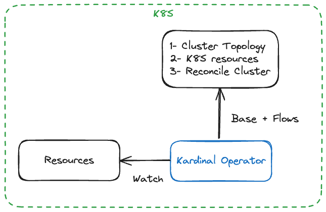

# Kardinal Operator

## Disclaimer: This project is no longer maintained.

Implementation of [Kardinal](https://github.com/kurtosis-tech/kardinal) as a K8S Operator.

## Overview

The Kardinal operator watches the cluster K8S resources, generates a cluster topology and applies changes to satisfy the cluster topology.  One difference with today is that the operator only manages what needs to be added to the user cluster (dev services, network resources…).  The operator does not reconcile user resources.  We introduce some k8s custom resources: service dependencies, flows, plugins and templates.  Those resources will be namespaced.

The operator performs the same operation each time one of the watched Flow custom resources is added or removed.

- Generate the base cluster topology from the list of services, dependencies, deployments, gateways…
- Generate flow topologies from the list of flows, plugins and templates.  Every operation performed by the operator needs to be idempotent which means the plugins need to be idempotent.
- Merge the topologies
- Generate the K8s resources needed (dev services, network resources…) to satisfy the merged topology and reconcile the cluster.



## Install

### Requirements

Istio is required and your namespaces should be labeled for injection.

```
istioctl manifest install --set profile=default

kubectl label namespace <namespace name> istio-injection=enabled
```

### Kardinal Operator

The Kardinal Operator is built using Kubebuilder.  Run the following commands to install the CRDs and the operator in the cluster pointed by your kubeconfig.  The operator runs in a newly created namespace `kardinal-operator-system`.

```
make deploy
```

## CRDs

### Flows

```yaml
apiVersion: core.kardinal.dev/v1
kind: Flow
metadata:
  labels:
    app.kubernetes.io/name: kardinal
    app.kubernetes.io/managed-by: kardinal-operator
  name: flow-test
  namespace: baseline
spec:
  service: frontend
  image: kurtosistech/frontend:demo-frontend
```

## Uninstall

Run the following commands to uninstall the CRDs and the operator in the cluster pointed by your kubeconfig.

```
make undeploy
```

## Development

Minikube + K8S manifest deployed. K8S context set to your local cluster.
```
make install (to install the CRDs into the cluster)
```

The following three commands are commonly used during development:

```
make lint (Run golangci linter. Can also be configured inside your IDE.)
make test (Run tests against local cluster)
make run (Run operator against your local cluster)
```

Manage custom resources with kubectl:

```
# Create a flow
kubectl create -f ./ci/flow-test.yaml

# Delete a flow
kubectl delete -f ./ci/flow-test.yaml

# Get all flows in namespace
kubectl get flows -n baseline

# Describe a flow by its name
kubectl describe flows flow-test -n baseline
```

### Update the CRDs API

1. Read [this document][api-design-doc] to follow the design rules.
2. The CRDs API files are inside the `./api/core/v1` folder.
3. You can edit the `flow` API for example:
   1. Add, update or remove fields in the `FlowSpec` inside the `flow_types.go` file. Don't forget to add the json tags.
   2. Run `make manifests` to include your changes in the auto generated `./config/crd/bases/core.kardinal.dev_flows.yaml` manifest file.
   3. Update the spec example inside `./config/samples/core_v1_flow.yaml`
4. If you are adding a new CRD make sure its schema has been added in the `init` function in the `./cmd/main.go` file


### Update the RBAC permissions

1. Read [this document][rbac-markers-doc] to understand what are the RBAC markers and how to compose them.
2. Add, update or remove the RBAC markers, for instance the `flow` controller:
   1. Open the flow controller file `./internal/controller/core/flow_controller.go`
   2. Edit the markers inside of it.
   3. Run `make manifests` to include your changes in the auto generated `./config/rbac/role.yaml` manifest file.
   4. NOTE: If you receive an error, please run the specified command in the error and re-run make manifests.

### Troubleshooting

#### Gateway

If you previously ran `Kardinal Manager`, you may already have a `gateway-istio` deployment in your cluster. This could lead to requests being
routed through it instead of the `gateway-istio` deployment in the `baseline` namespace. This issue arises because a gateway resource may
still exist. We recommend removing it —only if you're certain it was created by Kardinal— before deploying the `./ci/obd-demo.yaml` manifest.
You can do this with the following command: `kubectl delete Gateway gateway`

[api-design-doc]: https://book.kubebuilder.io/cronjob-tutorial/api-design
[rbac-markers-doc]: https://book.kubebuilder.io/reference/markers/rbac
